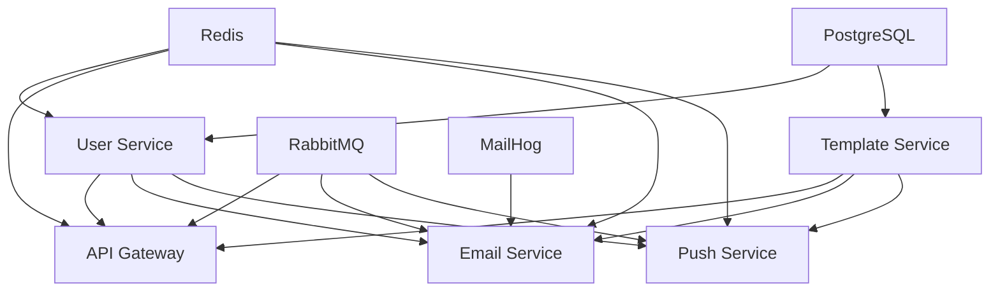

## Configuration Overview

The distributed notification system requires proper configuration of messaging, caching, and database infrastructure. This guide covers the setup and configuration of each component.

## RabbitMQ Setup

RabbitMQ serves as the message broker for asynchronous communication between services.

### Container Configuration

```yaml
rabbitmq:
  image: rabbitmq:3.11-management
  container_name: rabbitmq
  environment:
    RABBITMQ_DEFAULT_USER: ${RABBITMQ_USER:-guest}
    RABBITMQ_DEFAULT_PASS: ${RABBITMQ_PASS:-guest}
  ports:
    - "5673:5672"   # AMQP protocol
    - "15673:15672" # Management UI
  volumes:
    - rabbitmq_data:/var/lib/rabbitmq
  restart: unless-stopped
  healthcheck:
    test: ["CMD", "rabbitmq-diagnostics", "ping"]
    interval: 5s
    timeout: 10s
    retries: 5
    start_period: 10s
```

### Exchanges and Queues

The system uses a **direct exchange** pattern:

| Component | Name | Type | Purpose |
|-----------|------|------|----------|
| **Exchange** | `notifications.direct` | Direct | Routes messages to specific queues based on routing keys |
| **Queue** | `email.queue` | Durable | Stores email notification tasks |
| **Queue** | `failed.queue` | Durable | Stores failed notification attempts for retry |
| **Queue** | `push.queue` | Durable | Stores push notification tasks |

### Routing Keys

```yaml
email.created -> email.queue
push.created -> push.queue
*.failed -> failed.queue
```

### Connection URLs

**Internal (Docker network):**
```
amqp://rabbitmq:5672
```

**External (host machine):**
```
amqp://localhost:5673
```

### Management UI

Access the RabbitMQ management interface:

```
http://localhost:15673
Username: guest
Password: guest
```

<Warning>
Change default credentials in production deployments. The `guest/guest` credentials should only be used for local development.
</Warning>

### Service Integration

**Email Service Configuration:**

```bash
RABBITMQ_HOST=rabbitmq
RABBITMQ_USER=guest
RABBITMQ_PASS=guest
RABBITMQ_EXCHANGE=notifications.direct
RABBITMQ_EMAIL_QUEUE=email.queue
RABBITMQ_FAILED_QUEUE=failed.queue
```

**API Gateway & Push Service:**

```bash
RABBITMQ_URL=amqp://rabbitmq:5672
```

## Redis Configuration

Redis provides caching and rate limiting capabilities.

### Container Configuration

```yaml
redis:
  image: redis:7-alpine
  container_name: redis
  ports:
    - "6379:6379"
  volumes:
    - redis_data:/data
  restart: unless-stopped
```

### Connection Details

**Internal (Docker network):**
```
Host: redis
Port: 6379
```

**External (host machine):**
```
Host: localhost
Port: 6379
```

### Usage Patterns

| Service | Use Case | TTL |
|---------|----------|-----|
| **API Gateway** | Response caching | 300s (5 minutes) |
| **API Gateway** | Rate limiting | 60s (1 minute) |
| **Email Service** | Template caching | Variable |
| **User Service** | User preference caching | Variable |

### Service Integration

```bash
REDIS_HOST=redis
REDIS_PORT=6379
REDIS_TTL=300
```

### Persistence

Redis data is persisted to the `redis_data` volume. By default, Redis uses RDB snapshots:

- Snapshots created every 60s if at least 1000 keys changed
- Snapshots created every 300s if at least 100 keys changed
- Snapshots created every 900s if at least 1 key changed

## PostgreSQL Setup

PostgreSQL serves as the primary database for user and template data.

### Container Configuration

```yaml
postgres:
  image: postgres:15
  environment:
    POSTGRES_USER: ${POSTGRES_USER:-postgres}
    POSTGRES_PASSWORD: ${POSTGRES_PASSWORD:-your_password_here}
    POSTGRES_DB: ${POSTGRES_DB:-notification_db}
  ports:
    - "5432:5432"
  volumes:
    - pgdata:/var/lib/postgresql/data
  restart: unless-stopped
```

### Database Schema

The system creates a single database (`notification_db`) with separate schemas for each service:

- **User Service**: User accounts, preferences, notification settings
- **Template Service**: Notification templates, variables, metadata

### Connection Details

**Internal (Docker network):**
```
Host: postgres
Port: 5432
Database: notification_db
User: postgres
Password: your_password_here
```

**External (host machine):**
```
Host: localhost
Port: 5432
Database: notification_db
User: postgres
Password: your_password_here
```

### SSL Configuration

For production deployments, enable SSL/TLS:

```bash
DB_SSL_ENABLED=true
DB_CA_CERT=/path/to/ca-cert.pem
```

<Warning>
The default password `your_password_here` MUST be changed for production deployments. Use strong, randomly generated passwords.
</Warning>

### Service Integration

**User Service:**

```bash
DB_HOST=postgres
DB_PORT=5432
DB_USERNAME=postgres
DB_PASSWORD=your_password_here
DB_DATABASE=notification_system
DB_SSL_ENABLED=false
```

**Template Service:**

Template service connects to the same PostgreSQL instance but uses its own schema/tables.

## MailHog Setup

MailHog is an SMTP testing tool for local development.

### Container Configuration

```yaml
mailhog:
  image: mailhog/mailhog
  container_name: mailhog
  ports:
    - "1025:1025" # SMTP server
    - "8025:8025" # Web UI
  restart: unless-stopped
```

### Access Points

**SMTP Server:**
```
Host: mailhog (or localhost)
Port: 1025
Authentication: None
```

**Web Interface:**
```
http://localhost:8025
```

View all sent emails in the MailHog UI without actually sending them to recipients.

### Email Service Integration

```bash
SMTP_HOST=mailhog
SMTP_PORT=1025
SMTP_FROM=no-reply@test.com
SMPT_USER=
SMPT_PASS=
```

<Note>
For production, replace MailHog with a real SMTP provider (SendGrid, AWS SES, etc.) and configure proper credentials.
</Note>

## Service Dependencies

The `depends_on` configuration ensures proper startup order:

### Dependency Graph



### Startup Order

1. **Infrastructure** (postgres, redis, rabbitmq, mailhog) - Start first
2. **Data Services** (user-service, template-service) - Wait for postgres
3. **Gateway Services** (api-gateway, email-service, push-service) - Wait for all dependencies

### Health Check Dependencies

The email service uses a health check dependency:

```yaml
email-service:
  depends_on:
    rabbitmq:
      condition: service_healthy
    redis:
      condition: service_started
    mailhog:
      condition: service_started
```

**Behavior:**
- Email service waits for RabbitMQ health check to pass
- Starts after Redis and MailHog containers are running
- Prevents connection failures during startup

<Check>
Add health checks to all services in production for better orchestration and automatic recovery.
</Check>

## Configuration Files

Each service loads configuration from:

1. **`.env.example` files** (loaded via `env_file`)
2. **`environment` section** (overrides .env.example)
3. **Host environment variables** (highest priority)

### Priority Order

```
Host ENV variables > docker-compose environment > .env.example
```

### Development vs Production

Create separate `.env` files for different environments:

```bash
# Development
user-service/.env.development

# Production
user-service/.env.production
```

Update `docker-compose.yml` to use the appropriate file:

```yaml
env_file:
  - ./user-service/.env.production
```

## Monitoring and Debugging

### Check Service Health

```bash
# Check all containers
docker compose ps

# Inspect specific service
docker compose logs -f email-service

# Check RabbitMQ queues
docker exec rabbitmq rabbitmqctl list_queues

# Check Redis keys
docker exec redis redis-cli KEYS '*'

# Connect to PostgreSQL
docker exec -it postgres psql -U postgres -d notification_db
```

### Common Configuration Issues

| Issue | Symptom | Solution |
|-------|---------|----------|
| Service can't connect to RabbitMQ | Connection refused errors | Wait for RabbitMQ health check, verify RABBITMQ_URL |
| Redis connection timeout | Cache misses, timeout errors | Check REDIS_HOST and REDIS_PORT |
| PostgreSQL authentication failed | Login errors | Verify DB_USERNAME and DB_PASSWORD |
| Email service crashes on startup | Immediate restart loop | Check all required environment variables are set |

<Warning>
Always verify service connectivity before deploying. Use `docker compose logs` to debug startup issues.
</Warning>